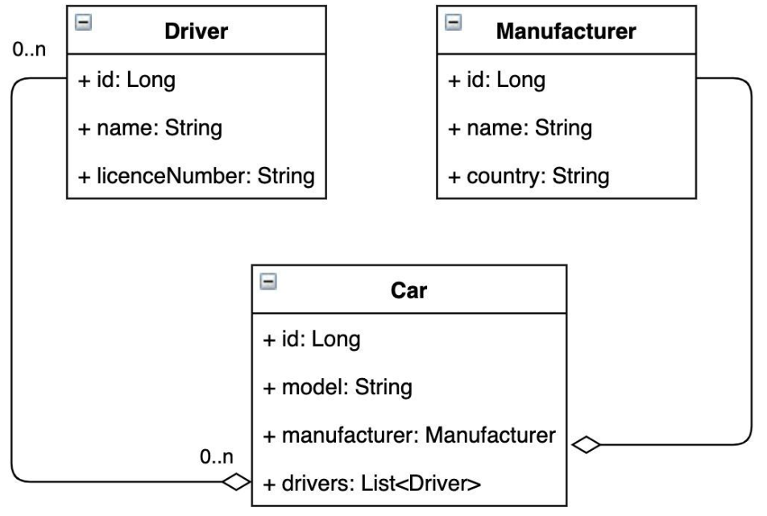
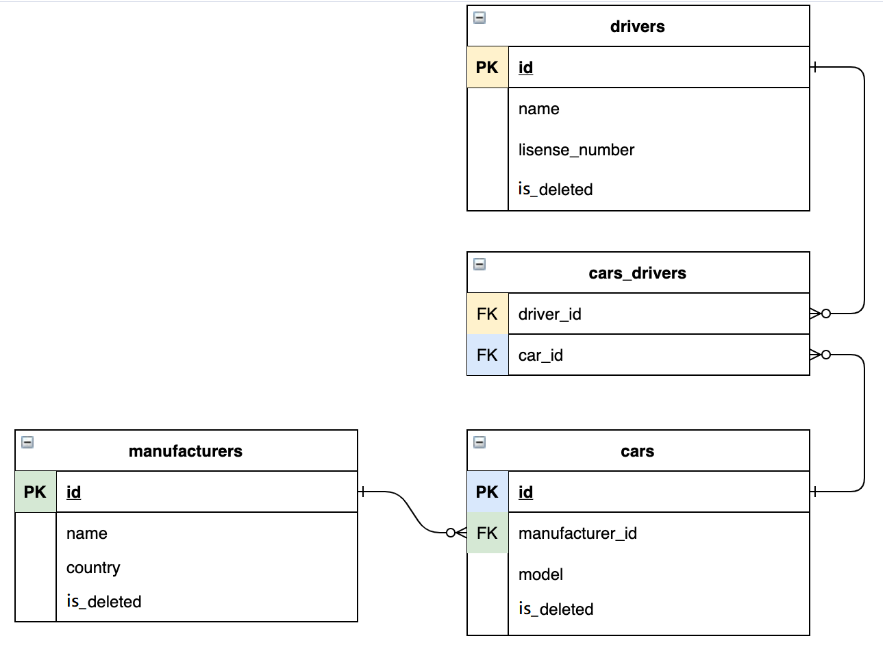

<h1>
:oncoming_taxi: 
 TAXI-SERVICE 
:oncoming_taxi:
</h1> 

### Project description:
> A simple web application that is designed according to SOLID principles,
> uses Dependency Injection to achieve Inversion of control
> and supports authentication and CRUD operations.

___

## Content

<a href="#features">Features</a> 
<a href="#project_structure">Project structure</a> 
<a href="#technologies">Technologies</a> 
<a href="#instructions">Instructions</a> 

___

<h2 id="features">
:star: Features
</h2>

* registration as a driver;
* authentication as a driver;
* create/update/remove a manufacturer;
* create/update/remove a car;
* create/update a driver;
* display list of all manufacturers;
* display list of all cars;
* display list of all drivers;
* display list of all cars by current driver;
* add driver to car.

___

<h2 id="project_structure">
:derelict_house: Project structure
</h2>

Application is divided into logical layers in accordance with N-tier architecture to separate responsibilities
and manage dependencies in project.

| Tier         | Responsibility                                                              |
|--------------|:----------------------------------------------------------------------------|
| Presentation | Uses Apache Tomcat as the web server and Controllers to interact with users |
| Logic        | Uses Services to perform data processing of an application                  |
| Data         | Uses DAOs to perform CRUD operations                                        |

<b><i>UML Diagram</i></b>

<b><i>DB Diagram</i></b>

___

<h2 id="technologies">
:computer: Technologies
</h2>

* JDK 11
* Maven 4.0.0
* MySql 8.0.30
* JDBC
* Java Servlet 4.0.1
* Tomcat 9.0.50
* JSTL 1.2, JSP, HTML, CSS
___
<h2 id="instructions">
:hammer_and_wrench: Instructions
</h2>

* Clone the repo from [here](https://github.com/svitlana-tertyshna/taxi-service); 
* Install MySQL; 
* Configure Apache Tomcat version (IMPORTANT): 9.0.5; 
* Copy and run [SQL script](/src/main/resources/init_db.sql) to creating a schema and tables for the project; 
* Configure [Connection Util](/src/main/java/taxi/util/ConnectionUtil.java) with your URL, USERNAME, PASSWORD, JDBC_DRIVER; 
* By default, you will be redirected on page login.jsp. 
* The access to main functionality will be opened after registration process on index.jsp page. 
* Feel free to look through opened links.

<h3><b>GOOD LUCK !</b> :rocket:</h3>
